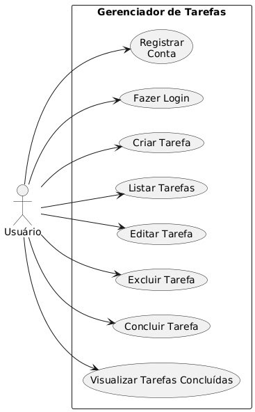
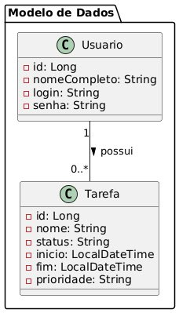
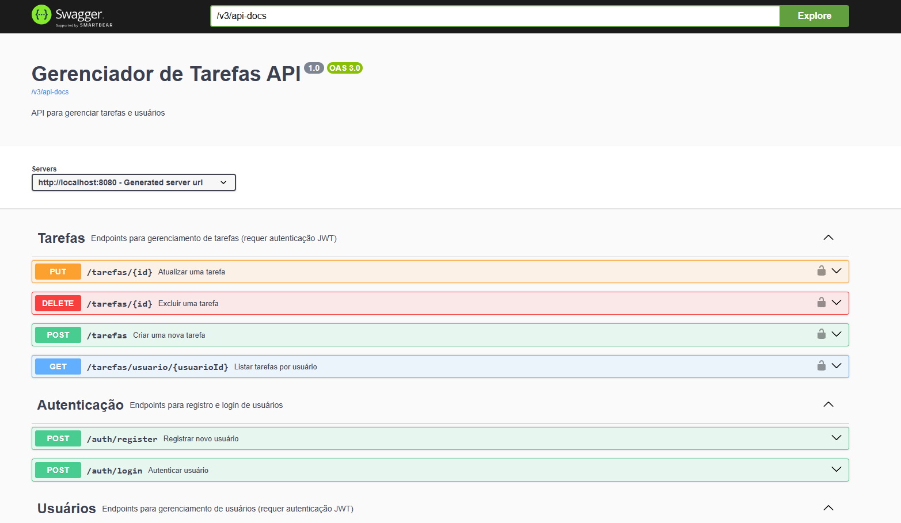
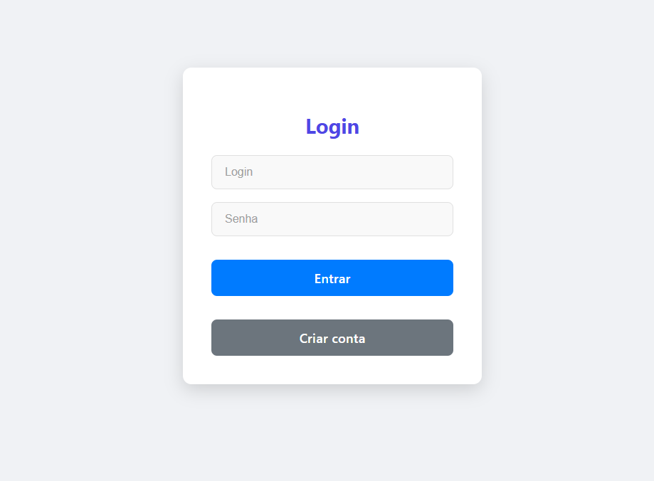
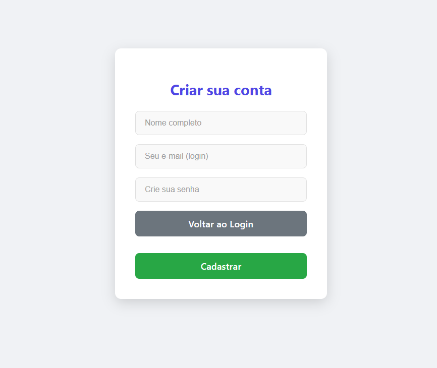
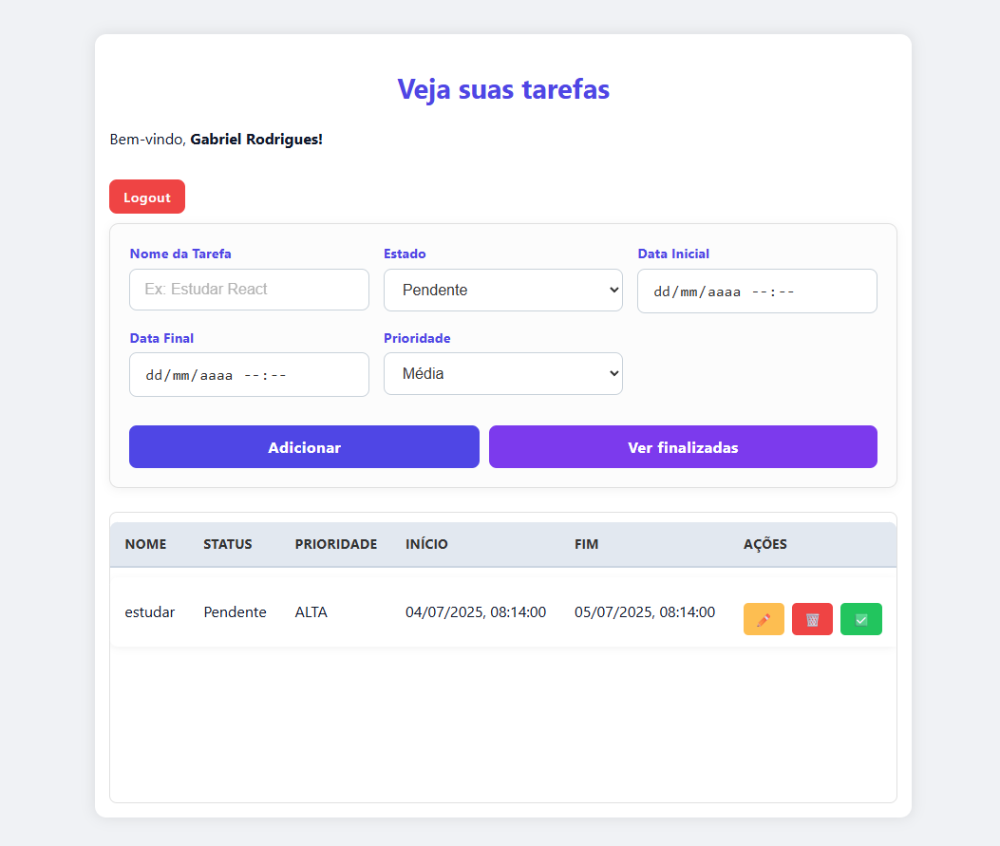

# Gerenciador de Tarefas

Sistema web Full Stack para gerenciamento de tarefas pessoais, com autenticação via JWT, documentação com Swagger, backend em Java + Spring Boot, frontend em React, banco MySQL e deploy com Docker.


## Tecnologias Utilizadas

- **Backend**: Java 21, Spring Boot, Spring Security, JWT, JPA, MySQL
- **Frontend**: React, Axios, Vite
- **Documentação**: Swagger (Springdoc OpenAPI)
- **Banco de Dados**: MySQL
- **Containers**: Docker e Docker Compose


## Funcionalidades

- Cadastro e login de usuários
- Autenticação via JWT
- CRUD de tarefas (criar, visualizar, editar, excluir, concluir)
- Visualização de tarefas pendentes ou concluídas
- Interface moderna e responsiva
- Documentação da API com Swagger


## Estrutura do Projeto

Na pasta raiz do projeto se encotra backend, frontend, imagens, dockercompose e README. Em backend tem a estrutura padrão de um projeto Spring Boot, onde em gerenciador-de-tarefas, src, main, java se encontram os pacotes e classes da aplicação. Frontend possui a estrutura padrão de um projeto react com Vite, onde dentro de src, pages tem os arquivos das páginas.

├── backend/ <br>
│   ├── Dockerfile <br>
│   └── gerenciador-de-tarefas/ <br>
│       ├── src/ <br>
│       │   └── main/ <br>
│       │       └── java/ <br>
│       │           └── com/gerenciador/gerenciador/de/tarefas/<br>
│       │               ├── controller/<br>
│       │               │   ├── AuthController.java <br>
│       │               │   ├── TarefaController.java<br>
│       │               │   └── UsuarioController.java<br>
│       │               ├── dto/<br>
│       │               │   ├── LoginRequest.java<br>
│       │               │   ├── LoginResponse.java<br>
│       │               │   ├── TarefaDTO.java<br>
│       │               │   └── UsuarioDTO.java<br>
│       │               ├── exception/<br>
│       │               │   ├── GlobalExceptionHandler.java<br>
│       │               │   ├── TarefaInvalidaException.java<br>
│       │               │   └── TarefaNaoEncontradaException.java<br>
│       │               ├── model/<br>
│       │               │   ├── Prioridade.java<br>
│       │               │   ├── Tarefa.java<br>
│       │               │   └── Usuario.java<br>
│       │               ├── repository/<br>
│       │               │   ├── TarefaRepository.java<br>
│       │               │   └── UsuarioRepository.java<br>
│       │               ├── security/<br>
│       │               │   ├── JwtFilter.java<br>
│       │               │   ├── JwtUtil.java<br>
│       │               │   ├── SecurityConfig.java<br>
│       │               │   └── UserDetailsServiceImpl.java<br>
│       │               ├── service/<br>
│       │               │   ├── TarefaService.java<br>
│       │               │   └── UsuarioService.java<br>
│       │               └── GerenciadorDeTarefasApplication.java (Classe Principal)<br>
│       └── pom.xml<br>
├── frontend/<br>
│   ├── Dockerfile<br>
│   ├── nginx.conf<br>
│   └── src/<br>
│       ├── pages/<br>
│       │   ├── Login.jsx<br>
│       │   ├── Login.css<br>
│       │   ├── Registro.jsx<br>
│       │   ├── Registro.css<br>
│       │   ├── Tarefas.jsx<br>
│       │   └── Tarefas.css<br>
│       └── main.jsx (ponto de entrada do React)<br>
├── imagens/<br>
│   └── ... (imagens de documentação ou logo)<br>
├── docker-compose.yml<br>
└── README.md<br>


## Diagramas

### Diagrama de casos de uso



O diagrama representa as ações que um usuário pode realizar no sistema:

O ator "Usuário" é quem interage com o sistema. As funções do sistema estão dentro do retângulo "Gerenciador de Tarefas" e incluem:

- Registrar Conta: criar um novo usuário.

- Fazer Login: autenticar-se no sistema.

- Criar Tarefa: adicionar uma nova tarefa.

- Listar Tarefas: visualizar as tarefas existentes.

- Editar Tarefa: modificar os dados de uma tarefa.

- Excluir Tarefa: apagar uma tarefa existente.

- Concluir Tarefa: marcar uma tarefa como finalizada.

- Visualizar Tarefas Concluídas: filtrar apenas as finalizadas.

### Diagrama de classes



O diagrama mostra a estrutura das entidades principais do sistema, ou seja, os dados que são persistidos no banco de dados:

- Usuario:

  - Possui os atributos id, nomeCompleto, login e senha.

  - Representa um usuário registrado no sistema.

- Tarefa:

  - Possui os atributos id, nome, status, inicio, fim e prioridade.

  - Representa uma tarefa criada por um usuário.

- Relacionamento:

  - Um usuário pode ter zero ou muitas tarefas associadas (1 → 0..*).

  - Esse relacionamento é representado como Usuario possui Tarefa.

## Segurança com JWT e Spring Security
Este projeto utiliza Spring Security em conjunto com JWT (JSON Web Token) para garantir a segurança das rotas protegidas da aplicação.

Após o login, o servidor gera um token JWT assinado contendo as informações do usuário autenticado. Esse token é enviado ao frontend e armazenado localmente. A cada nova requisição, o token é enviado no cabeçalho (Authorization) e validado por um filtro customizado (JwtFilter) antes de permitir o acesso aos endpoints protegidos.


## Documentação da API com Swagger
Este projeto conta com uma documentação interativa da API gerada automaticamente com Swagger, por meio da biblioteca springdoc-openapi.

A documentação permite visualizar todos os endpoints disponíveis, seus métodos HTTP, parâmetros de entrada, respostas esperadas e exemplos. Isso facilita o entendimento da API tanto para desenvolvedores quanto para integradores.



## Executando o Projeto

### Pré-requisitos

- git
- Docker + Docker Compose instalados
- Gerenciador Maven suportando o comando mvn no terminal


### Execução do programa

clone o repositorio:

```bash
git clone https://github.com/grsantos56/gerenciador-de-tarefas
cd gerenciador-de-tarefas
```

para iniciar a aplicação digite:
```
docker-compose up --build
```

Certifique-se que tenha todas as ferramentas necessárias para utilizar o sistema. <br>

Quando finalizar o build da aplicação acesse:
- http://localhost:5173/login - Para usar o programa
- http://localhost:8080/swagger-ui/index.html - Para verificar a documentação da api

## Segurança
- JWT Token enviado no header Authorization (Bearer <token>)

- Endpoints /auth/**, /swagger-ui/**, /v3/api-docs/** são públicos

- Demais rotas exigem autenticação

## Imagens do projeto





## Observações
- A API utiliza autenticação stateless com JWT

- As tarefas são associadas ao usuário autenticado via ID

- Tarefas com data final menor que a inicial são rejeitadas no frontend

##  Autor
Gabriel Rodrigues <br>
Desenvolvedor Fullstack | Projeto de Estágio <br>
GitHub: @grsantos56
